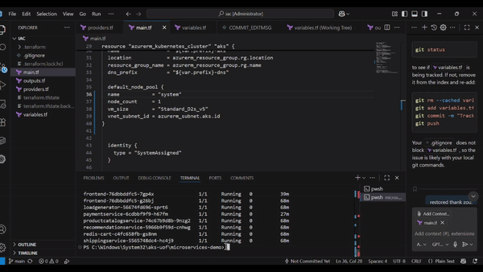
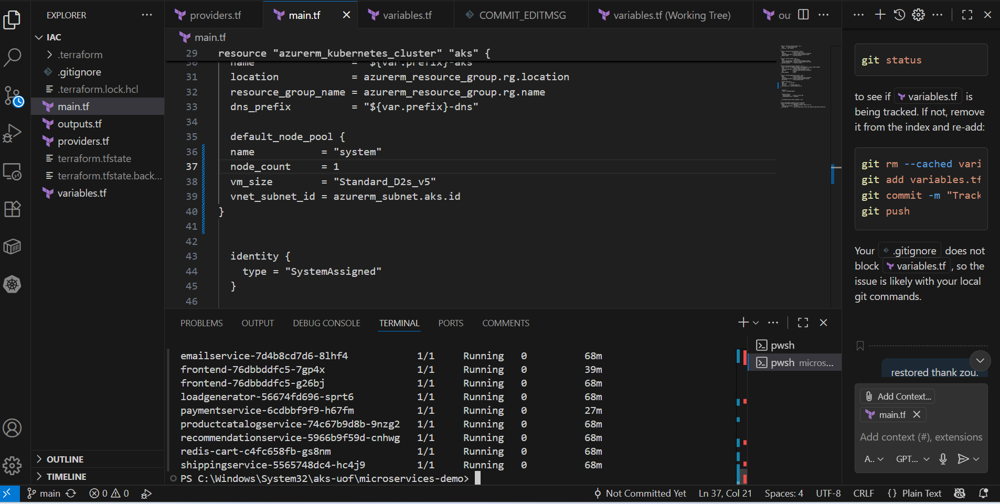
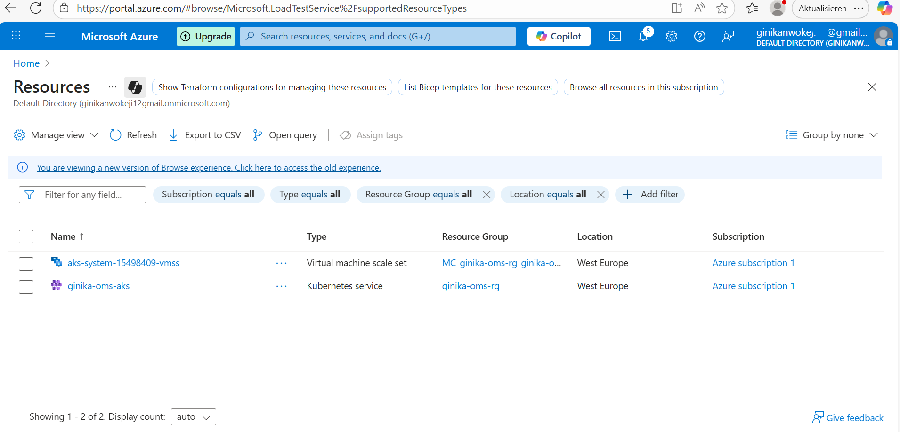
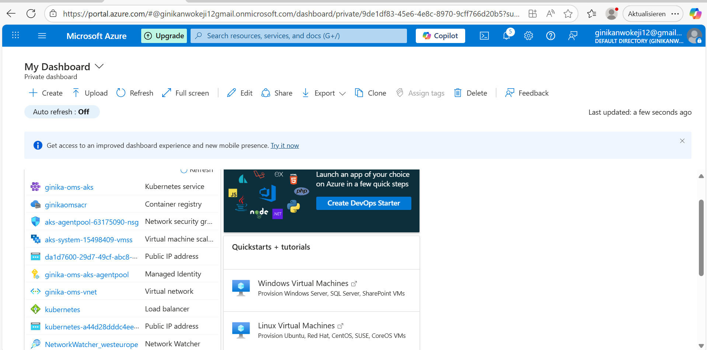
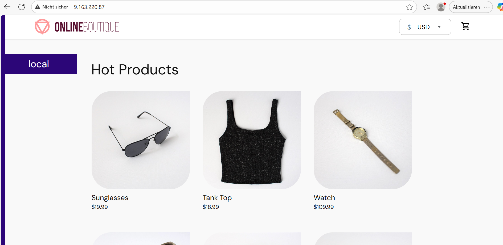
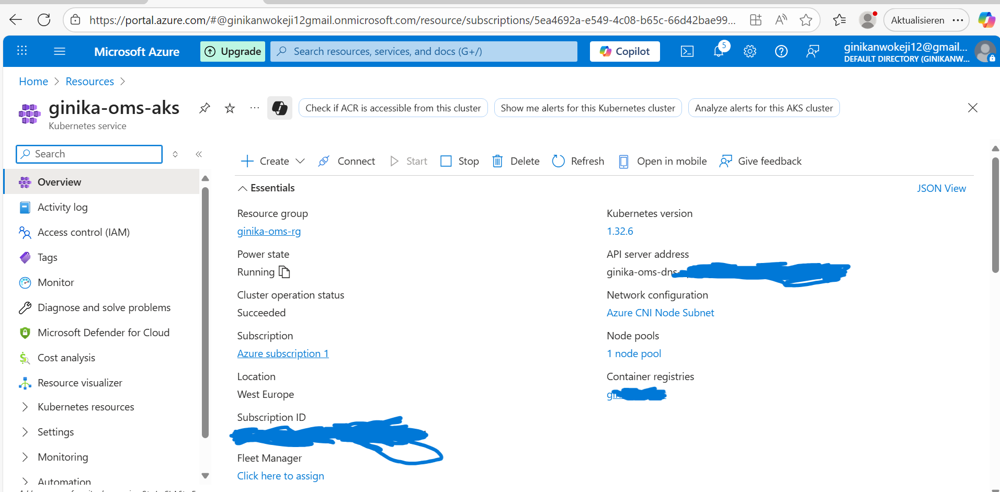
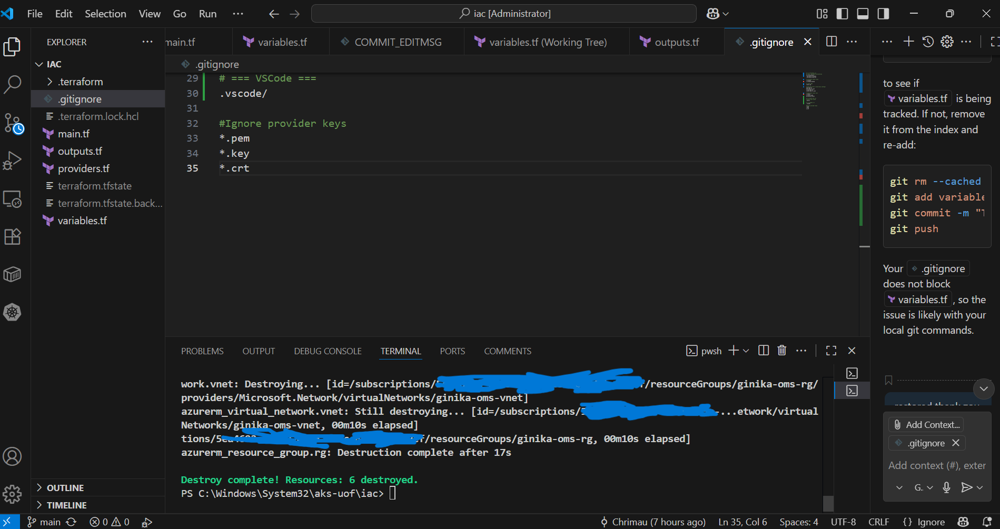
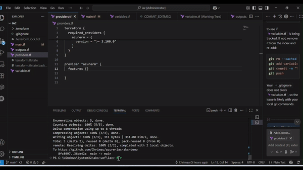

# AKS Demo: Blue/Green Microservices on Azure Kubernetes Service

This repo provisions a minimal **Azure AKS** cluster with **VNet/Subnet + ACR** via **Terraform**, deploys the **Google Microservices Demo** to Kubernetes, and demonstrates **blue/green** switching for the `frontend` service. It also includes **HPA**, **least-privilege RBAC**, a **PodDisruptionBudget**, and an Azure **DNS label** on the LoadBalancer.

> Stack: Azure (AKS, ACR, VNet/Subnet, Public IP), Terraform, kubectl, Helm (client), Azure CLI, Kubernetes (HPA/RBAC/PDB)

  ▶️ 
---

## 1) What this shows (at a glance)
- ✅ **IaC**: Reproducible AKS + Networking + ACR with Terraform  
- ✅ **Cluster access**: az aks get-credentials from Terraform outputs  
- ✅ **App deployment**: `microservices-demo` (11 services)  
- ✅ **Blue/Green**: Two `frontend` Deployments with **zero-downtime switch** via Service selectors  
- ✅ **Ops basics**: HPA, RBAC (least privilege), PDB, DNS label on Service (public URL)  
- ✅ **Cost care**: Small node sizes + cleanup commands

---

## 2) Repo layout
```

aks-oms/
├─ media/                     # Media files
│  ├─ xxxxx.gif
│  ├─ xxxxx.gif
│  ├─ xxxxx.gif
│  ├─ xxxxx.png
│  └─ xxxxx.png
│  └─ xxxxx.png
│  └─ xxxxx.png
│  └─ xxxxx.png
│  └─ xxxxx.png
│  └─ xxxxx.png
│  └─ xxxxx.png
├─ iac/                     # Terraform (AKS, VNet/Subnet, ACR, roles)
│  └─ .gitignore
│  ├─ main.tf
│  ├─ providers.tf
│  ├─ outputs.tf
│  ├─ variables.tf
├─ k8s/                     # RBAC/PDB/HPA patches & blue/green variants
│  ├─ anti-frontend.yaml 
│  ├─ pdb-frontend.yaml
│  ├─ rolebinding-support-read.yaml
│  ├─ role-support-read.yaml
└─ README.md

````

---

## 3) Prerequisites
- Azure CLI, Terraform ≥ 1.6, kubectl, Helm (client)
- Azure subscription with permissions for AKS + ACR + Networking

Quickly verify your tools:
```bash
az version
terraform version
kubectl version --client
helm version
````
Install any missing tool, I recommend using [chocolatey](https://chocolatey.org/install)
---

## 4) provision zour infrastructure

```bash
# Login and select your subscription
az login
az account set --subscription "<YOUR_SUBSCRIPTION_ID>"

# Clone this repo
git clone https://github.com/Chrimau/azure-iac-aks-demo.git
cd azure-iac-aks-demo

# Terraform up
terraform fmt && terraform init && terraform validate
terraform apply -auto-approve

# Fetch kubeconfig from TF outputs
rg=$(terraform output -raw rg)
aks=$(terraform output -raw aks_name)
az aks get-credentials -g "$rg" -n "$aks" --overwrite-existing

# Confirm cluster
kubectl get nodes
```


>  If you hit a **quota** error, reduce the node size/count in `main.tf`like i did and autoscale later:

```hcl
default_node_pool {
  name           = "system"
  node_count     = 1
  vm_size        = "Standard_D2s_v5"
  vnet_subnet_id = azurerm_subnet.aks.id
}
```

I auto-scaled after by editing the above node pool section and increasing the node count. Also ensure your desired vm is available in your deployment region.
---


## 5) Deploy the demo application

```bash
# Get the app manifests
git clone --depth 1 --branch v0 https://github.com/GoogleCloudPlatform/microservices-demo.git
cd microservices-demo

# Deploy
kubectl apply -f ./release/kubernetes-manifests.yaml
kubectl get pods -w
kubectl get svc frontend-external
```





# Watch the Demo!


Copy the `EXTERNAL-IP` and open to see your frontend running:

```
http://<EXTERNAL-IP-address>
```



**Optional:** Add an Azure DNS label on the LB service for a friendly URL:

```yaml
kubectl edit svc frontend-external
```

```yaml
# kubectl edit svc frontend-external
annotations:
  service.beta.kubernetes.io/azure-dns-label-name: ginika-demo
```

URL becomes:

```
http://ginika-demo.westeurope.cloudapp.azure.com
```

---

## 6) Blue/Green switch for `frontend`

Create two deployments from the base:

```bash
# Export base
kubectl get deploy frontend -o yaml > frontend-base.yaml

# Create blue
# (PowerShell one-liners in docs; committed yaml variants live in k8s/frontend-blue.yaml)
# Then:
kubectl apply -f k8s/frontend-blue.yaml

# Create green
kubectl apply -f k8s/frontend-green.yaml
```

Point Service to **blue** first (safety):

```bash
kubectl patch svc frontend           -p '{"spec":{"selector":{"app":"frontend","version":"blue"}}}'
kubectl patch svc frontend-external  -p '{"spec":{"selector":{"app":"frontend","version":"blue"}}}'
```

Switch to **green** (zero-downtime):

```bash
kubectl patch svc frontend           -p '{"spec":{"selector":{"app":"frontend","version":"green"}}}'
kubectl patch svc frontend-external  -p '{"spec":{"selector":{"app":"frontend","version":"green"}}}'
```

**Anti-affinity & PDB:**

```bash
kubectl apply -f k8s/anti-frontend.yaml
kubectl apply -f k8s/pdb-frontend.yaml
```

**HPA:**

```bash
kubectl autoscale deploy frontend-blue  --cpu-percent=60 --min=2 --max=4
kubectl autoscale deploy frontend-green --cpu-percent=60 --min=2 --max=4
kubectl get hpa
```

---

## 7) Least-privilege RBAC (support read-only)

```bash
kubectl apply -f k8s/role-support-read.yaml
kubectl apply -f k8s/rolebinding-support-read.yaml
```

This defined role allows a support user to **get/list/watch** pods, pod logs, and services in the `default` namespace — nothing more.

---

## 8) Operability tips

* If CPU spikes crash the demo, scale down the load generator:

  ```bash
  kubectl scale deploy loadgenerator --replicas=0
  ```
* Verify where pods land:

  ```bash
  kubectl get pods -l app=frontend -o wide
  ```
* Confirm the Service selector (blue/green):

  ```bash
  kubectl get svc frontend -o yaml | grep -A3 selector
  kubectl get svc frontend-external -o yaml | grep -A3 selector
  ```

---

## 9) CI/CD (suggested)

* **GitHub Actions**: Build/test Terraform plan on PR, apply on `main` via `workflow_dispatch` to avoid surprise costs.
* **Container builds** (if you own images): push to ACR, then `kubectl set image` or use Helm/Kustomize.

---

## 10) Cleanup (avoid costs)

```bash
# Remove app
kubectl delete -f ./microservices-demo/release/kubernetes-manifests.yaml || true

# Destroy infra
cd ../iac
terraform destroy -auto-approve
```


---


## 11) Security best practices

* `.gitignore` excludes **tfstate**, **tfvars**, and local caches.
* Never commit secrets; use Key Vault / GitHub Encrypted Secrets for CI.
* Use **AcrPull** role assignment for AKS kubelet identity to pull from ACR.

Watch the Demo!



---

## 14) Troubleshooting

* **Quota**: reduce `vm_size` and `node_count`, auto-scale later.
* **No EXTERNAL-IP**: wait for LB provisioning; ensure `Standard` SKU and public egress.
* **HPA not scaling**: make sure metrics server is available in your cluster.

---

## 15) License

MIT (or your preferred license)


## Quick Overview

**iac/providers.tf**

```hcl
terraform {
  required_version = ">= 1.6"
  required_providers {
    azurerm = {
      source  = "hashicorp/azurerm"
      version = ">= 3.100.0"
    }
  }
}
provider "azurerm" {
  features {}
  subscription_id = "<YOUR_SUBSCRIPTION_ID>"
  tenant_id       = "<YOUR_TENANT_ID>"
}
```

**iac/variables.tf**

```hcl
variable "prefix"     { default = "ginika-oms" }
variable "location"   { default = "westeurope" }
variable "node_count" { default = 3 }
```

**iac/main.tf**
*(check main.tf file)*

**iac/outputs.tf**

```hcl
output "rg"       { value = azurerm_resource_group.rg.name }
output "aks_name" { value = azurerm_kubernetes_cluster.aks.name }
```

**k8s/role-support-read.yaml**

```yaml
apiVersion: rbac.authorization.k8s.io/v1
kind: Role
metadata:
  name: support-read
  namespace: default
rules:
- apiGroups: [""]
  resources: ["pods","pods/log","services"]
  verbs: ["get","list","watch"]
```

**k8s/rolebinding-support-read.yaml**

```yaml
apiVersion: rbac.authorization.k8s.io/v1
kind: RoleBinding
metadata:
  name: support-read-bind
  namespace: default
subjects:
- kind: User
  name: support.engineer@your-domain.tld
roleRef:
  apiGroup: rbac.authorization.k8s.io
  kind: Role
  name: support-read
```

**k8s/pdb-frontend.yaml**

```yaml
apiVersion: policy/v1
kind: PodDisruptionBudget
metadata:
  name: pdb-frontend
  namespace: default
spec:
  minAvailable: 1
  selector:
    matchLabels:
      app: frontend
```

**k8s/anti-frontend.yaml**

```yaml
spec:
  template:
    spec:
      affinity:
        podAntiAffinity:
          requiredDuringSchedulingIgnoredDuringExecution:
          - labelSelector:
              matchLabels:
                app: frontend
            topologyKey: "kubernetes.io/hostname"
```

---

